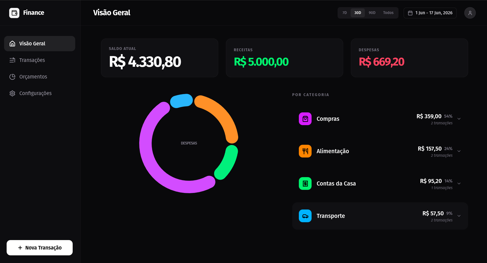
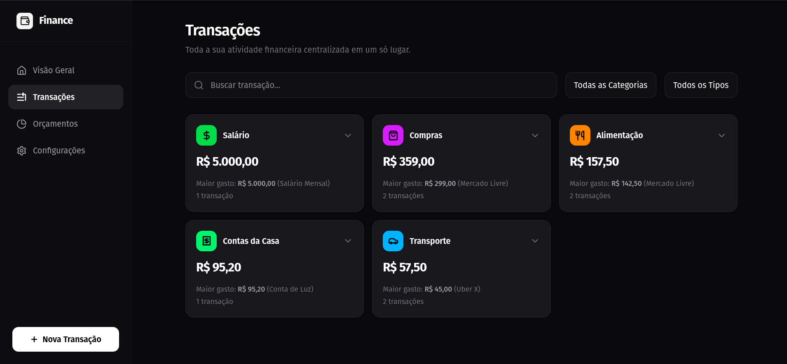
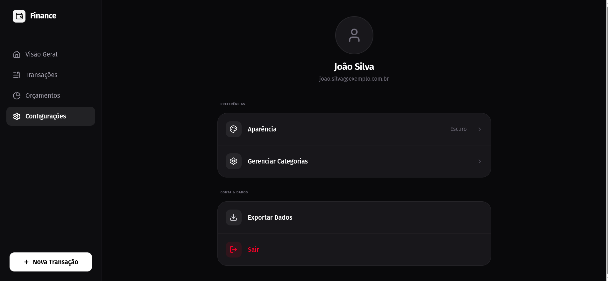

# Prisma — Painel Financeiro

Frontend **open source** do Prisma: landing page, autenticação e painel financeiro completo em modo escuro, para organizar receitas, despesas e categorias.

## Interface

### Landing Page + Autenticação
Landing com identidade fintech e rotas de **login** e **cadastro** (JWT + Bcrypt no backend). Ao entrar, o usuário cai direto no painel.

### Visão Geral (Dashboard)
Saldo atual, receitas, despesas, economia líquida e donut de gastos por categoria.


### Transações
Lista completa com categorias coloridas, busca e filtros.


### Categorias e Configurações
Gerencie categorias com cores próprias (despesas e receitas) e ajuste seu perfil.


## Stack Tecnológica

| Camada | Tecnologia |
|--------|-----------|
| **UI** | React 19 + TypeScript |
| **Build** | Vite 6 |
| **Estilização** | Tailwind CSS 4 + shadcn/ui |
| **Ícones** | Lucide React |
| **Gráficos** | Recharts |
| **Animações** | Motion (Framer Motion) |
| **Fonte** | Geist Variable |

## Executando Localmente

**Pré-requisitos:** Node.js (ou Docker, para a opção completa).

1. Instale as dependências:
   ```bash
   npm install
   ```
2. Configure o arquivo `.env` (utilize o `.env.example` como base — defina `VITE_API_URL`):
   ```bash
   cp .env.example .env
   ```
3. Inicie o servidor de desenvolvimento:
   ```bash
   npm run dev
   ```
   Acesse `http://localhost:3000` (a landing abre em `/`; login em `/#/login`; cadastro em `/#/cadastro`).

### Build de produção

```bash
npm run build       # gera a pasta dist/ (consome VITE_API_URL)
npm run preview     # serve o build localmente
```

### Lint

```bash
npm run lint        # tsc --noEmit
```

### Docker

```bash
# Do repositório raiz do projeto (Prisma), com backend + banco:
docker compose up --build -d
# Frontend publicado em http://localhost (Nginx)
```

## Scripts

| Comando | Descrição |
|---------|-----------|
| `npm run dev` | Dev server na porta 3000 |
| `npm run build` | Build de produção (Vite) |
| `npm run preview` | Serve o build localmente |
| `npm run lint` | Type check (`tsc --noEmit`) |

## Estrutura de pastas

```
src/
├── landing/          # Landing page (components + content)
├── auth/             # Login, cadastro e AuthContext
├── dashboard/        # Home do painel
├── transactions/     # Transações
├── categories/       # Categorias
├── finance/          # FinanceContext + TransactionFormContext
└── shared/           # Componentes, tipos, serviços e constantes
```

## Variáveis de ambiente

| Variável | Descrição | Padrão |
|----------|-----------|--------|
| `VITE_API_URL` | Base URL da API Spring Boot | `http://localhost:8080` |