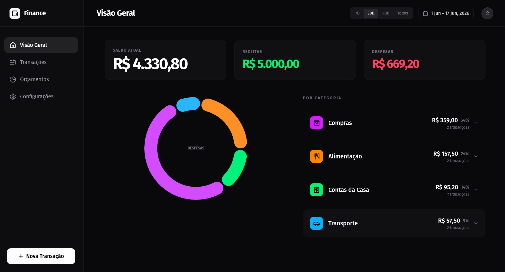
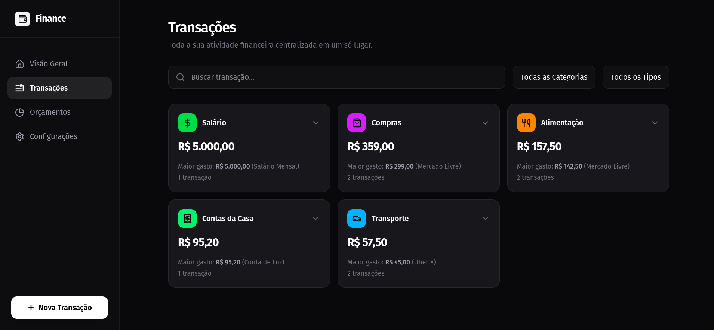
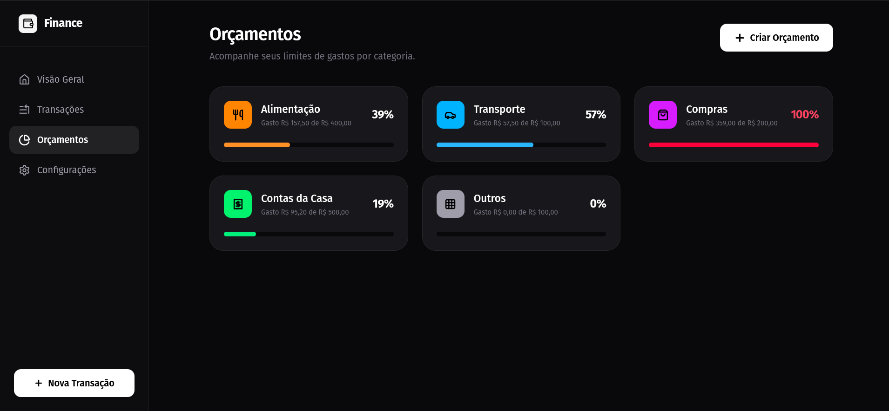
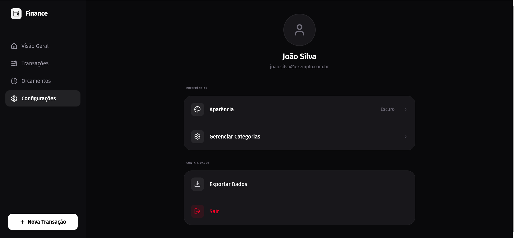

# 💎 Prisma Dashboard

**Live Demo:** [Coming Soon] | **Deploy:** VPS (Docker Containers)
**Status:** 🚧 In Development (Front-end completed, Back-end on roadmap)

## 📸 Interface

### Overview


### Transactions


### Budgets


### Settings


## 📌 The Problem
Personal finance control often suffers from rigid interfaces or difficult-to-maintain spreadsheets. Prisma centralizes the management of income and expenses in a fluid interface, allowing you to quickly visualize cash flow health and make agile decisions.

## 🏗️ Architectural Decisions
The stack was chosen focusing on parity between development and production, prioritizing financial data integrity:

* **Backend (Java/Spring Boot):** Maturity in security (Spring Security/JWT) and stability for the financial core.
* **Frontend (Angular):** Strong structural organization and strict typing (TypeScript) for manipulating states in the interface.
* **Database (PostgreSQL):** Strict transactional integrity (ACID), essential for handling balances and transactions.
* **Infrastructure (Docker):** Containerization from day one to ensure predictable and frictionless deployments on the VPS.

### 🗄️ System Entities (Database)
The API was designed in a relational way, connecting the following entities:
* **Users:** Access data (protected with Bcrypt Hash) and Stateless session management.
* **Categories:** Custom label system (tags) to group finances.
* **Transactions:** The core of the system. Incomes (Revenue) or expenses, mandatorily linked to a User and a Category.

## ⚙️ Local Setup

The entire application ecosystem has been containerized. You do not need to install dependencies (such as Java or Node.js) directly on your machine to test the project.

### Prerequisites
* Git
* Docker and Docker Compose

### Initialization Steps

**1. Clone the repository**
```bash
git clone https://github.com/seu-usuario/prisma-dashboard.git
cd prisma-dashboard
```

**2. Configure Environment Variables**
Make a copy of the example file to create your local environment file:
```bash
cp .env.example .env
```
*(Open the generated `.env` file and fill in the default variables, such as the database credentials and the JWT secret key).*

**3. Build and Run**
Bring up the entire infrastructure with a single command:
```bash
docker compose up --build -d
```

**Accessing the application:**
* **Dashboard (Frontend Angular):** `http://localhost:4200`
* **REST API (Backend Spring):** `http://localhost:8080`

## 🛣️ Technical Roadmap
The project is iterative. Below are the development stages:

- [x] UI/UX design and Angular interface developed.
- [ ] API construction (Spring Boot) and persistence (PostgreSQL).
- [ ] Implementation of Authentication and Authorization (Spring Security).
- [ ] Deployment of the database and API on VPS.
- [ ] Deployment of the frontend on Vercel (or similar).

---
*Project developed for portfolio and personal use, focusing on software engineering best practices.*