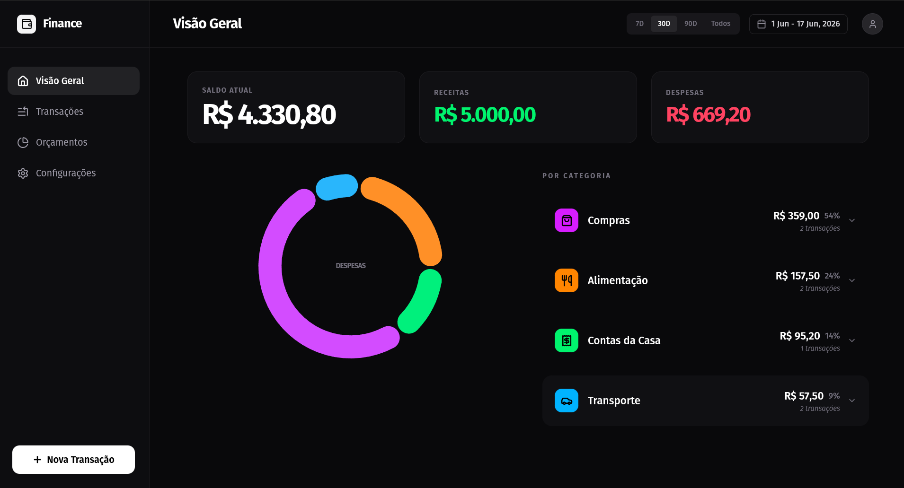
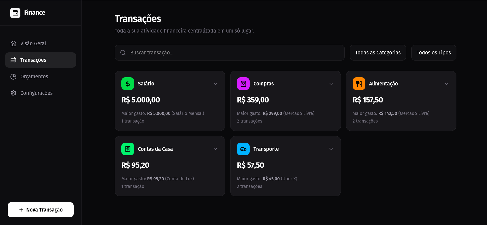
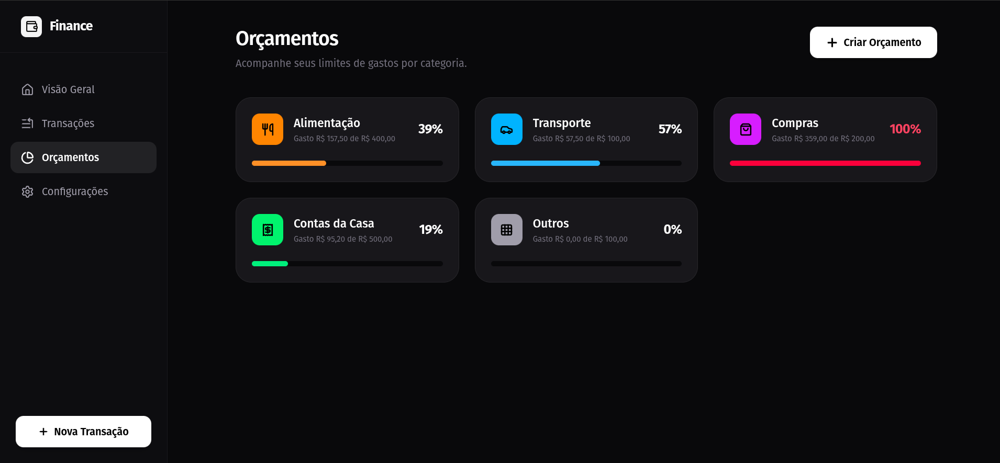
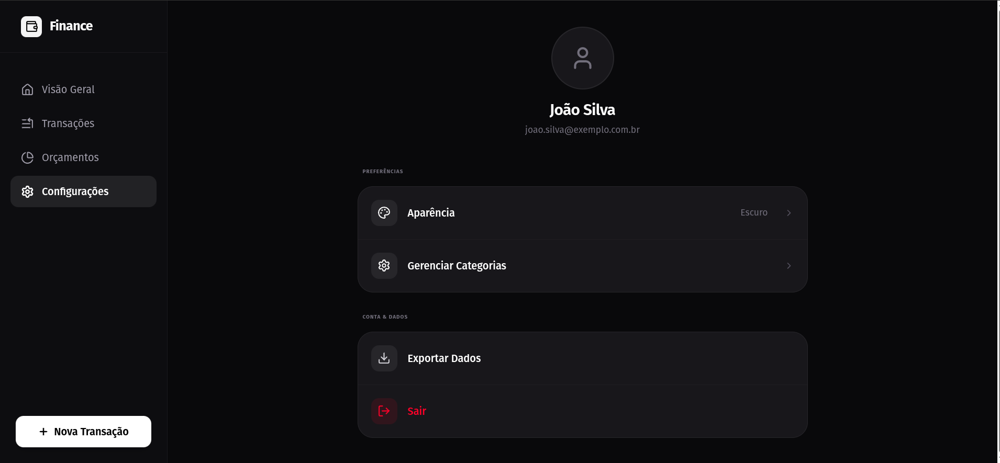

# Prisma — Painel Financeiro & CRM

> Ferramenta **open source** para organizar receitas, despesas, orçamentos, metas e contatos em um painel escuro, rápido e direto ao ponto.



---

## ✨ O que o Prisma faz

- **Landing page** com identidade fintech, dark mode e rota para login/registro.
- **Autenticação** por e-mail e senha com token JWT (Bcrypt no backend).
- **Dashboard**: saldo atual, receitas, despesas, economia líquida, donut de gastos por categoria e atividade recente.
- **Transações**: registro de receitas e despesas em BRL, cards por categoria, busca e filtros.
- **Orçamentos**: limites mensais por categoria com barra de progresso e alerta visual.
- **Categorias**: CRUD completo com cores próprias.
- **Metas**: valor alvo, economia mensal, progresso e previsão de prazo.
- **CRM**: clientes, leads, parceiros e fornecedores com busca.

## 🖼️ O sistema em ação

| | |
|---|---|
| Transações  | Orçamentos  |

| Configurações  | |
|---|---|

> As capturas refletem o estado mais recente do painel (modo escuro, tema lime).

---

## 🧱 Stack Tecnológica

| Camada | Tecnologia |
|--------|-----------|
| **Frontend** | React 19 + TypeScript + Vite 6 |
| **Estilização** | Tailwind CSS 4 + shadcn/ui |
| **Ícones** | Lucide React |
| **Gráficos** | Recharts |
| **Animações** | Motion (Framer Motion) |
| **Fonte** | Geist Variable |
| **Backend** | Java / Spring Boot + Spring Security (JWT, Bcrypt) |
| **Banco** | PostgreSQL 15 |
| **Infra** | Docker + Docker Compose |
| **Servidor web** | Nginx (SPA estática) |

---

## 🚀 Como executar

### Opção 1 — Docker (recomendado)

```bash
# 1. Clone o repositório
git clone <seu-repo>
cd Prisma

# 2. Configure as variáveis de ambiente do backend
cp .env.example .env

# 3. Configure as variáveis do frontend
cp Front-end/DashboardFinanceiroFrontEnd/.env.example Front-end/DashboardFinanceiroFrontEnd/.env

# 4. Suba o banco, o backend e o frontend
docker compose up --build -d
```

**Acessos após o `docker compose up`:**

| Serviço | URL |
|---------|-----|
| Frontend (produção, Nginx) | http://localhost |
| Frontend (desenvolvimento) | http://localhost:3000 |
| API (Spring Boot) | http://localhost:8080 |
| Banco (PostgreSQL) | localhost:5433 |

### Opção 2 — Desenvolvimento (sem Docker)

```bash
# Backend (Spring Boot) — dentro da pasta do backend
./mvnw spring-boot:run

# Frontend (Vite) — dentro de Front-end/DashboardFinanceiroFrontEnd
npm install
npm run dev
```

> O frontend lê a URL da API de `VITE_API_URL` (padrão: `http://localhost:8080`).

---

## 🔐 Variáveis de ambiente

### Root (`.env`) — backend

```bash
KEY_POSTGRES_PORT=5432
KEY_POSTGRES_DATABASE_NAME=prisma
KEY_POSTGRES_USER=seu_usuario
KEY_POSTGRES_PASSWORD=sua_senha
JWT_SECRET=seu_segredo_jwt
TIME_EXPIRATION_DTO=7200
CORS_ALLOWED_ORIGINS="http://localhost:3000,http://localhost"
```

### Frontend (`Front-end/DashboardFinanceiroFrontEnd/.env`)

```bash
VITE_API_URL="http://localhost:8080"
```

---

## 🔒 Segurança

- Senhas armazenadas com **Bcrypt** e autenticação por **JWT**.
- Para habilitar HTTPS (TLS) em produção — certificado, Nginx, redirecionamento e renovação automática — siga o guia: [SEGURANCA_HTTPS.md](./SEGURANCA_HTTPS.md).

---

## 📁 Estrutura

```
Prisma/
├── Back-end/                          # API Spring Boot (Java)
├── Front-end/DashboardFinanceiroFrontEnd/
│   ├── src/
│   │   ├── landing/                   # Landing page (React)
│   │   ├── auth/                      # Login, cadastro e contexto
│   │   ├── dashboard/                 # Home do painel
│   │   ├── transactions/              # Transações
│   │   ├── budgets/                   # Orçamentos
│   │   ├── categories/                # Categorias
│   │   ├── goals/                     # Metas
│   │   ├── contacts/                  # CRM
│   │   └── shared/                    # Componentes, tipos e serviços
│   └── Dockerfile                     # Build + Nginx
├── docker-compose.yml                 # db + backend + frontend
├── .env.example
└── README.md
```

---

*Prisma © 2026. Todos os direitos reservados. Projeto open source — rode com Docker.*